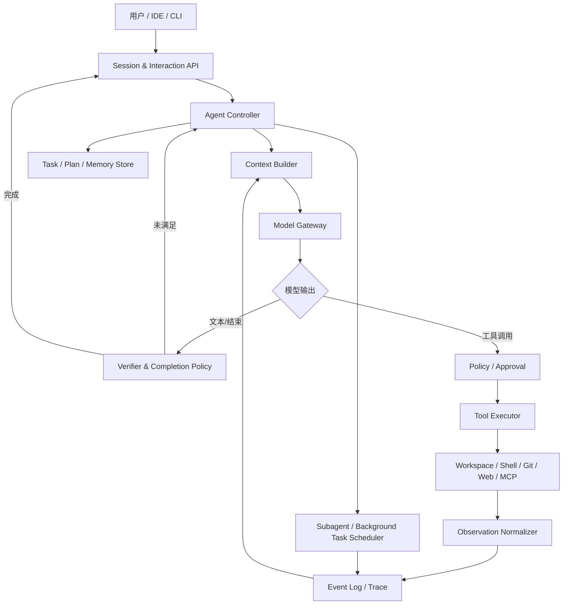
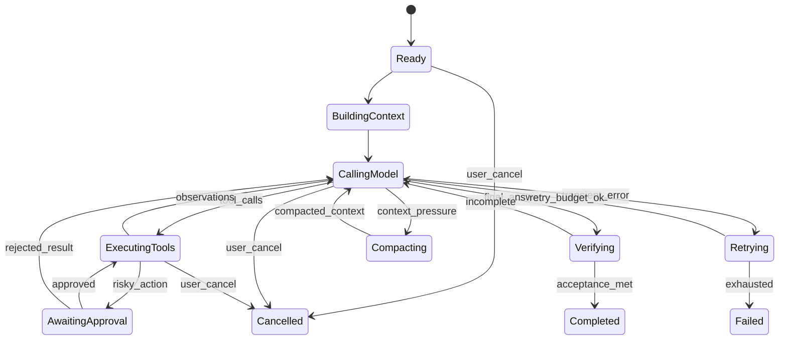

# 从 JD 看 Coding Agent 的真实工程问题

## 问题地图

| JD 信号 | 背后的工程能力 | 可以如何验证 |
|---|---|---|
| Coding Agent 核心系统 | 能从零设计 Agent Runtime，不依赖框架黑盒 | 系统设计、伪代码、故障分析 |
| 执行循环、任务拆解、错误恢复 | 状态机、终止条件、重试语义、持久化恢复 | “设计一个能跑一小时的 Agent” |
| 文件、Shell、搜索、测试、Git | 开发者工具基本功与安全边界 | 工具 API 设计、并发/取消、沙箱 |
| 仓库级上下文工程 | 检索、选择、压缩、记忆、token 预算 | “百万行仓库如何找对上下文” |
| 真实用户 trace、评测集 | 数据驱动调试，不靠 demo 和体感 | 给失败轨迹定位根因、设计 eval |
| 模型协作与能力边界 | 能区分模型问题与 Runtime 问题 | A/B、消融、错误归因 |
| CLI / IDE / 远程执行 | 系统工程、交互体验、协议兼容 | 架构设计、端到端延迟 |
| 产品 sense | 从用户任务而非技术炫技定义成功 | 竞品分析、需求优先级 |

## 一句话系统画像

> 把概率性的模型决策，封装进确定性的软件约束与反馈闭环，使 Agent 在真实代码仓库中长期、可靠、安全地完成任务。

## 问题之间的关系

| 主题 | 在系统中的关注度 |
|---|---:|
| Agent Loop 与 Runtime | 核心状态与控制流 |
| 工具调用、Shell、编辑、Git、沙箱 | 副作用与安全边界 |
| 上下文工程与记忆 | 决策输入的质量 |
| 长任务、恢复、并发、Subagent | 生产可靠性 |
| Evaluation、Trace、Observability | 迭代与归因闭环 |
| 产品与竞品 | 真实用户价值 |

本文跳过 Python 语法、装饰器、GIL 等语言基础，但会保留 `asyncio` 取消传播、子进程管理、结构化并发、流式 I/O 等与 Agent Runtime 直接相关的工程问题。

---

# Agent Runtime：从聊天到闭环执行

## 什么是 Coding Agent

普通代码助手完成的是 `输入 → 生成`；Coding Agent 完成的是：

```text
目标 → 观察环境 → 决策 → 调用工具 → 环境发生变化
    → 再观察 → 修正计划 → 验证 → 结束或交还用户
```

它至少包含四个要素：

- **模型：** 做语义理解、推理和动作选择；
- **工具：** 读取与改变外部世界；
- **状态：** 保存目标、消息、计划、任务、权限和产物；
- **控制器：** 决定何时调用模型、执行工具、压缩、重试、暂停和结束。

### Agent 和 Workflow 有什么区别？

> Workflow 的路径主要由代码预定义，模型填充局部节点；Agent 的下一步路径主要由模型根据环境反馈动态决定。它们不是二选一。生产系统通常是“确定性外壳包住 Agent”：权限、预算、重试、状态转换由代码控制，任务内的搜索、编辑和验证策略由模型选择。能用确定性流程解决的部分不应无谓 Agent 化。

### 为什么 Coding Agent 比一般 Agent 难？

- 代码仓库大而稀疏，正确上下文只占极小部分；
- 工具具有真实副作用，错误命令可能破坏工作区或泄露数据；
- 任务成功往往延迟到测试、构建甚至用户验收后才知道；
- 软件任务是长尾分布，语言、构建系统、仓库规范差异大；
- 长链路中早期小错误会累积，模型容易偏离目标；
- “测试通过”也可能是删测试、过拟合可见测试或改变无关行为；
- 用户会中途追加要求、打断、修改文件，环境并非静态。

## 一个生产级 Agent Runtime



核心原则：

- **模型不是状态机。** 模型可以建议动作，Runtime 必须验证动作是否允许。
- **事件日志是真相源。** UI 展示、恢复、评测和调试应尽量由同一事件流投影。
- **可取消是一级能力。** 模型流、工具、子进程、Subagent 都要有明确取消语义。
- **结果必须闭环。** 每个 tool call 都应有对应 result，包括失败、拒绝和中断。
- **终止不是一句“完成了”。** 应由完成策略结合测试、diff、任务约束和预算判断。

## Agent Loop 状态机



下面这段伪代码刻意把状态与边界显式化：

```python
async def run_turn(session, user_input):
    await session.append_event(UserMessage(user_input))
    budget = Budget(max_steps=80, max_cost=5.0, deadline=now() + 30 * MINUTE)

    while not budget.exhausted():
        snapshot = await session.snapshot()
        context = await context_builder.build(snapshot, budget.remaining())

        try:
            response = await model.generate(
                context=context,
                tools=tool_registry.schemas(snapshot.permission_mode),
                cancel_scope=session.cancel_scope,
            )
        except ContextOverflow:
            await compact(session)
            continue
        except TransientProviderError as error:
            await retry_with_backoff(error, budget)
            continue

        await session.append_event(ModelResponse(response))

        if response.tool_calls:
            validated = policy.validate(response.tool_calls, snapshot)
            results = await execute_with_limits(validated, session.cancel_scope)
            # 成功、失败、拒绝、中断都写入结果，保持调用/结果配对
            await session.append_events(results)
            budget.charge(results)
            continue

        verdict = await completion_policy.verify(response, snapshot)
        if verdict.accepted:
            await session.append_event(TurnCompleted(verdict))
            return response.final_text

        await session.append_event(VerifierFeedback(verdict.feedback))

    return await hand_back_to_user(reason=budget.exhaustion_reason)
```

### 循环何时结束？

不能只依赖模型说“done”。终止条件分四类：

- **任务成功：** 验收条件满足，必要测试通过，diff 符合范围；
- **需要用户：** 需求歧义、高风险操作、凭据或外部信息缺失；
- **资源耗尽：** step、token、成本、时间、重试预算到达上限；
- **不可恢复失败：** 环境损坏、权限拒绝、确定性错误无法绕过。

我的取舍是“宁可显式 handoff，也不能无限循环”。循环检测可使用：

- 连续相同工具与近似参数；
- workspace hash / git diff 长时间不变；
- 同一错误签名重复；
- 计划节点没有进展；
- 观察文本相似度过高；
- 单位成果成本持续恶化。

### 如何避免模型不停重试同一个错误？

> 我会把错误结构化为 `kind / retryable / blame / signature / suggested_action`。网络超时可指数退避并加 jitter；schema 错误应反馈具体字段让模型修正；权限拒绝应作为确定结果回到上下文；编译失败要保留关键诊断；相同错误签名超过阈值后禁止原动作，要求换策略或交还用户。重试预算按错误域分别计算，避免一个工具吃光整轮预算。

## Planning 与执行

计划的价值不是让回答看起来有条理，而是：

- 外化长任务状态，降低目标遗忘；
- 提供进度与可解释性；
- 形成可检查的中间契约；
- 便于失败恢复和多人/多 Agent 协作。

计划不应成为僵硬脚本。推荐结构：

```yaml
goal: 修复并验证鉴权缓存竞态
acceptance:
  - 最小复现测试在修复前失败、修复后通过
  - 不改变公开 API
constraints:
  - 不升级无关依赖
steps:
  - id: reproduce
    status: completed
    evidence: tests/test_auth_cache.py::test_concurrent_refresh
  - id: locate
    status: in_progress
  - id: patch
    status: pending
  - id: verify
    status: pending
open_questions:
  - token refresh 是否允许重复但结果幂等？
```

### 每个任务都要先生成完整计划吗？

> 不需要。计划成本应与任务不确定性匹配。单文件明确修改可直接执行；跨模块、有高副作用或超过若干步的任务先做轻量计划；架构变更先只读探索并让用户审阅。计划应滚动更新，环境证据推翻假设时允许重规划。

## 我会先守住六个 Runtime 不变量

Agent Loop 很容易写出来，真正难的是让任意异常都不能破坏下面这些条件：

1. **一个逻辑动作只有一个身份。** 重试可以产生多个物理 attempt，但不能让外部系统把它们当成多个业务动作。
2. **每个工具调用最终闭合。** 成功、失败、拒绝、取消和结果未知都必须形成 terminal result。
3. **历史事件只解释，不重演。** replay 用来重建状态，绝不能顺便再次执行 Shell、写文件或发布。
4. **权限只能收缩，不能由模型提升。** 模型可以请求能力，授权主体只能是策略或用户。
5. **完成必须带证据。** “我已经修好”不是状态转换条件，测试、diff 和 acceptance 才是。
6. **取消最终会收敛。** 模型流、子进程、后台任务和 Subagent 都必须在可观测时间内结束或进入明确的 `unknown` 状态。

我倾向于把这些不变量写进 reducer 和 property-based test，而不是只放在 system prompt 里。Prompt 能影响模型选择，但不能承担一致性。

## 一次 Turn 更像事务，而不是一次函数调用

假设 Agent 要修复一个鉴权缓存竞态。模型提出运行测试，测试进程成功退出，但 Runtime 在写入 `ToolExecutionFinished` 之前崩溃。恢复时，系统看到的最后一个事实仍然是 `ToolExecutionStarted`。

这时有三个看似合理、实际完全不同的动作：

- 直接重跑：对只读测试通常可以，但若命令包含数据迁移就可能重复副作用；
- 直接假定成功：会把未验证结果写进上下文；
- 标记结果未知并 reconcile：最保守，也最符合事实。

因此我会把工具生命周期拆成意图、attempt 和结果三层：

```text
LogicalAction
  action_id        # 跨重试稳定
  intent_hash      # 规范化参数 + scope + workspace revision

ToolAttempt
  attempt_id       # 每次物理执行唯一
  action_id
  started_at
  executor_id
  deadline

ToolOutcome
  action_id
  status           # succeeded | failed | cancelled | rejected | unknown
  effect_fingerprint
  artifact_refs
```

`action_id` 解决逻辑幂等，`attempt_id` 保留真实执行次数，`effect_fingerprint` 用来恢复时核对外部世界。例如文件编辑的 fingerprint 可以包含目标路径、base hash 和结果 hash；远端发布则应优先使用对方支持的 idempotency key 或查询发布记录。

### 事件落盘和副作用无法原子提交怎么办？

大多数工具无法和本地 event store 做分布式事务。我不会假装存在 exactly-once，而是按工具能力选择：

| 工具类型 | 恢复策略 |
|---|---|
| 文件读取、搜索 | 安全重放 |
| 带 base hash 的文件编辑 | 检查结果 hash；已应用则补记成功，冲突则返回 stale |
| 可查询状态的远端任务 | 用 action ID 查询并 reconcile |
| 支持幂等键的 API | 以逻辑 action ID 重试 |
| 无查询、无幂等的外部动作 | 标记 `unknown_outcome`，禁止自动重放 |

这条边界决定 Runtime 是否可信。只讨论“失败后重试三次”而不讨论未知结果，通常还停留在普通 API 客户端的思路。

## 一个跨文件修改的完整控制流

以“给鉴权客户端增加请求去重，同时不改变公开 API”为例，我会让一次任务经历下面的状态：

```text
1. 接收目标，抽取 acceptance 与 forbidden changes
2. 读取仓库规则、Git 基线和当前 dirty diff
3. 搜索 token refresh 定义、调用方与并发测试
4. 形成最小假设：竞态发生在 cache miss 到写回之间
5. 先写可稳定复现的并发测试
6. 测试失败，记录错误签名与执行环境
7. 基于 base hash 应用局部 patch
8. 运行目标测试、相关模块测试和静态检查
9. 比较最终 diff 与任务范围，确认没有改测试语义
10. verifier 检查 acceptance，生成带证据的完成事件
```

关键不是固定这十步，而是每一步都产生下一步可以复用的证据。若第 6 步测试没有稳定失败，就不应假装已经复现；若第 8 步环境发生变化，成功证据必须绑定新的 revision。这样计划才是运行状态，而不是展示给用户看的装饰。

## Kimi Code 公开实现：Session 是 Runtime 的事实边界

Kimi Code 的公开文档里，有一个比“支持继续会话”更值得注意的细节：session 不只保存聊天文本，还会为每个 Agent 保存独立的 `wire.jsonl` 事件流。它既用于恢复和 replay，也保留模型请求、工具定义、MCP 工具列表等请求 trace；session 本身则用 `state.json` 保存元数据。参见 [Sessions and context](https://moonshotai.github.io/kimi-code/en/guides/sessions.html)。

这部分是公开事实。我的工程判断是：Kimi Code 的 Runtime 已经把“可恢复的执行历史”和“给用户看的对话”当成了两种不同的数据。这个区分很重要，因为 transcript 只能说明模型和用户说过什么，event stream 才能说明工具是否开始、结果是否闭合、哪个 Agent 在什么上下文里执行过。

公开 Changelog 中出现过几类很有代表性的修复：

- turn 被打断在 tool call 与 tool result 之间时，恢复后不能丢掉后续用户消息；
- provider 对 tool call ID 有严格要求时，要处理重复 ID；
- compaction 交接需要保留最新意图、关键工具结果、已有决策、待解决问题和后续计划；
- 中断留下的未闭合工具调用，需要恢复成协议合法、语义明确的历史。

这些条目单看像边角 bug，连起来却刚好覆盖了 Runtime 最难的几条不变量：事件闭合、顺序一致、恢复幂等和状态交接。版本细节可在官方 [Changelog](https://moonshotai.github.io/kimi-code/en/release-notes/changelog.html) 中核对。

如果由我验证这套设计，我不会只测“关闭终端后能不能继续聊天”，而会在边界上故意杀进程：

```text
模型响应完成 / tool call 尚未落盘
tool call 已落盘 / 工具尚未启动
工具产生副作用 / tool result 尚未落盘
用户 steering 到达 / 旧 turn 尚未结束
compaction snapshot 写入 / 新上下文尚未启用
Subagent 完成 / 主 Agent 尚未接收结果
```

每个 crash point 都检查三件事：副作用有没有重复、事件能否收敛到唯一终态、恢复后的 Agent 是否仍在同一个目标和 workspace revision 上。对 Kimi 这种要承载长时间软件工程任务的 Harness 来说，这比 Agent Loop 写得多漂亮更能说明 Runtime 是否成熟。

---
