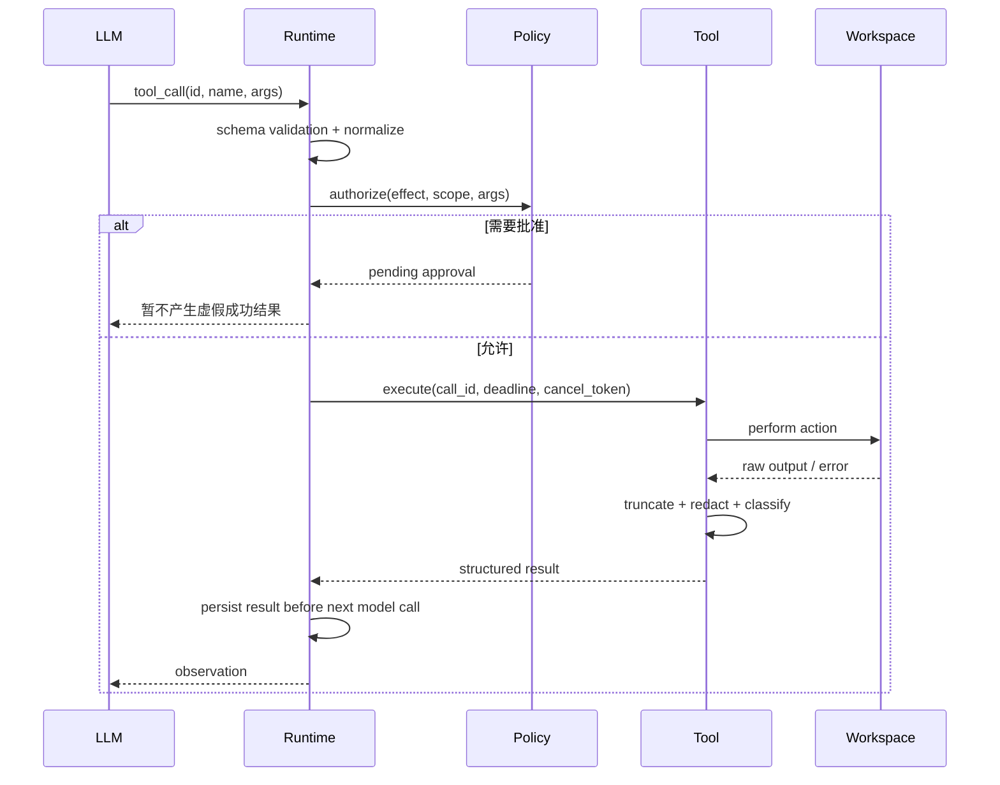
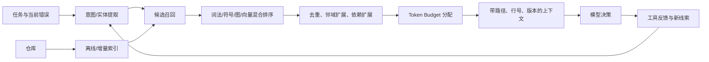

# 工具系统：Agent 的手和脚

## 工具 API 的设计原则

模型看到的工具不是普通内部 API。它的调用方具有概率性，因此接口应：

- **语义单一：** 一个工具做一类明确动作，避免几十个互斥参数；
- **名字可区分：** `search_text`、`find_symbol` 比 `query`、`execute` 更易选对；
- **Schema 严格：** 枚举、必填项、范围、路径类型尽量明确；
- **结果紧凑：** 先给关键事实，再给分页/句柄，避免淹没上下文；
- **错误可行动：** 告诉模型为何失败、能否重试、下一步选项；
- **副作用可见：** 描述中标注只读、写入、网络、持久、可逆；
- **可观测：** 每次调用有稳定 ID、时间、状态、资源消耗和产物引用；
- **可取消、可限额：** 超时、输出上限、进程树终止、并发限制；
- **可演进：** Schema 有版本，旧 session replay 时仍能解释历史调用。

一个结构化结果：

```json
{
  "status": "failed",
  "error": {
    "kind": "stale_file",
    "retryable": true,
    "message": "文件在读取后被修改",
    "expected_sha256": "…",
    "actual_sha256": "…",
    "suggested_action": "重新读取目标片段后生成新 patch"
  },
  "metrics": {
    "duration_ms": 13,
    "output_bytes": 0
  }
}
```

### 为什么不只提供一个万能 Shell？

> Shell 表达力最强，但可发现性、结果结构、安全策略和跨平台性都差。读取、搜索、编辑、测试等高频动作适合专用工具：参数更受约束、结果更紧凑，也便于做权限与评测。Shell 仍作为逃生舱处理长尾任务。合理设计是“常用能力窄接口 + Shell 兜底”，不是彻底禁用 Shell。

### 工具应该粗粒度还是细粒度？

> 过细会增加轮次、延迟和选择错误；过粗会隐藏中间状态、难以恢复和授权。我按“一个可独立理解、可授权、可重试的原子意图”切分。只读批量查询可以粗一些；有副作用的动作要细到能单独审计和批准。最终通过 trace 看工具误选率、平均调用数和任务成功率，而不是凭审美决定。

## 工具调用生命周期



关键不变量：

1. `tool_call_id` 在 session 内唯一；
2. 每个已记录的 call 最终有且只有一个 terminal result；
3. side effect 与事件落盘的次序必须明确；
4. replay 不应重复执行历史副作用；
5. 取消也要生成 `interrupted` 结果，不能留下悬空调用；
6. 工具输出进入模型前要做大小限制、敏感信息处理和来源标注。

## 并行工具调用

适合并行：

- 多个互不依赖的只读搜索；
- 独立文件读取；
- 无共享环境的检查任务；
- 明确隔离工作区的 Subagent。

不应直接并行：

- 多个可能编辑同一文件的动作；
- 一个命令依赖前一个命令生成的文件；
- Git index / branch 等全局可变状态；
- 会争抢端口、数据库或构建缓存的任务。

可以为工具声明 effect：

```text
READ(path-set)
WRITE(path-set)
PROCESS(spawn)
NETWORK(domain-set)
GIT_INDEX
WORKSPACE_GLOBAL
```

调度器依据 effect 做冲突检测。模型提出的并行只是建议，Runtime 才是最终裁决者。

### 工具执行成功但结果事件还没落盘，进程崩溃了，如何恢复？

这是典型的外部副作用与本地日志无法原子提交问题。

- 只读工具可安全重放；
- 幂等写工具使用 `idempotency_key` 和预期版本；
- 文件编辑可检查目标内容 hash 或 patch 是否已应用；
- 外部 API 若支持幂等键则透传；
- 非幂等且无法确认的动作标记为 `unknown_outcome`，恢复时要求用户确认，不能盲目重放；
- event log 中记录 intent、开始、结果和 side-effect fingerprint。

## 文件读取、搜索与编辑

#### 文件读取

- 默认带行号并限制行数/字节数；
- 大文件支持 range、head、tail、按符号读取；
- 二进制、压缩包、生成文件要识别；
- 返回编码、换行符、是否截断、内容 hash；
- 防止符号链接越界和路径穿越。

#### 搜索

- 文本搜索优先使用仓库原生快速工具（如 ripgrep）；
- 支持 glob、语言、目录、最大结果数；
- 结果分组去重，展示命中上下文；
- 明确“0 结果”与“搜索失败/被截断”的区别；
- 大结果返回句柄或分页，不把几万行塞回模型。

#### 编辑策略对比

| 策略 | 优点 | 主要风险 | 适用 |
|---|---|---|---|
| 整文件重写 | 简单，模型容易生成 | token 大，误删并发修改，格式漂移 | 小文件或新文件 |
| Search/Replace | 直观、局部 | 锚点不唯一、空白敏感 | 唯一稳定片段 |
| Unified Diff / Patch | 可审阅、表达多处改动 | 模型 patch 可能不合法、上下文过期 | 通用代码编辑 |
| AST/CST 编辑 | 结构安全、可重构 | 多语言成本高，保留格式困难 | 重命名、导入、结构改造 |
| IDE/LSP WorkspaceEdit | 与编辑器生态结合 | 依赖语言服务与客户端能力 | IDE 场景 |

生产实现通常组合使用。关键保护：

- 读时返回 `base_hash`，写时做 compare-and-swap；
- patch 应用前检查目标路径与 hunk；
- 写临时文件后原子替换，保留权限和换行；
- 修改后立刻返回 diff 摘要；
- 允许撤销，至少能恢复 Agent 自己的修改；
- 用户已有改动不是 Agent 的“脏数据”，不得擅自覆盖。

### 用户在 Agent 运行中手动改了同一文件怎么办？

> 不能以最后写入获胜。读文件时记录版本或 hash，写入时乐观并发控制；冲突后重新读取并尝试三方合并。若语义冲突无法自动解决，暂停让用户选择。Agent 的修改、用户原有未提交修改和基线版本应能区分，最好通过 patch provenance 或隔离 worktree 管理。

## Shell 与长进程

Shell 工具至少要处理：

- 工作目录和环境变量的显式继承；
- stdout / stderr 流式读取与背压；
- 最大输出、超时和静默超时；
- PTY 与非 PTY 差异；
- 前台转后台、查询、写 stdin、终止；
- 终止整个进程组而不只杀父进程；
- exit code、signal、duration 的结构化返回；
- ANSI 清理、二进制输出、编码错误；
- Windows / POSIX 差异；
- 密钥脱敏和日志策略。

### `asyncio` 取消一个 Shell 工具时，怎样确保没有孤儿进程？

> 子进程应运行在独立 process group/session 中。收到取消后先发温和终止信号，等待短暂 grace period，再强制杀进程组；同时继续 drain 管道，避免子进程因 pipe 满而卡住。取消路径写入结构化结果并 await 清理完成。父协程、输出泵和超时任务使用结构化并发统一收束，不能创建无人管理的 background task。

### 命令输出 2GB 怎么办？

> 执行层不能无限缓存。采用 ring buffer + 流式落盘：UI 可看实时窗口，模型只收到头尾、关键诊断和“已截断”标记，完整输出存 artifact 并给句柄。对编译/测试输出可做解析器，优先抽取失败用例、错误位置和摘要。限制既按字节也按 token 估算。

## Git 工作流

Agent 应理解：

- worktree 是否干净、哪些改动属于用户；
- tracked / untracked / ignored 的区别；
- diff、staged diff、基线 commit；
- 分支、worktree、merge conflict；
- 不应擅自 commit、push、丢弃用户更改；
- 测试生成物与真正代码改动的区分。

一个安全流程：

```text
记录基线和初始 dirty diff
→ 修改
→ 检查 diff 范围
→ 运行目标测试
→ 运行更广回归
→ 再次检查 diff
→ 向用户报告修改、验证、未解决风险
```

### 如何判断 Agent 有没有“作弊”通过测试？

- 检查是否修改/删除测试、fixture、配置和断言；
- 运行隐藏测试或独立 verifier；
- 检查生产代码是否硬编码样例；
- mutation testing：改变输入是否仍满足语义；
- 比较任务前后测试发现数量；
- 静态规则检测 skip、xfail、异常吞噬；
- 让第二个 verifier 只看需求、diff 和测试证据；
- 评测环境将测试目录设为只读。

## MCP：协议层而不是智能层

MCP 将外部能力标准化为客户端/服务端协议，常见原语包括：

- **Tools：** 模型可选择调用的动作；
- **Resources：** 可读取的上下文资源；
- **Prompts：** 可发现的提示模板；
- 以及能力协商、生命周期、通知和不同 transport。

### MCP 解决了什么，没解决什么？

> 它解决连接与互操作：工具发现、schema、调用和结果传输可以跨产品复用。它不自动解决工具质量、权限、安全、正确选择、上下文污染和任务成功。Host 仍负责信任、授权、隔离、用户同意、输出限制和审计。协议兼容不等于语义可靠。

### 接入一个第三方 MCP Server 要做哪些防护？

- Server 身份、来源和版本固定；
- 工具清单与 schema 变更检测；
- 每工具最小权限、网络和文件范围；
- 展示真实调用目标，避免相似名称欺骗；
- 工具描述与返回内容都视为不可信数据；
- 防 prompt injection、数据外传和跨工具组合攻击；
- OAuth token 按 server、用户和 scope 隔离；
- 设置超时、输出上限、速率限制；
- 记录 server/version/tool/call/result 审计链；
- 高风险调用要求用户确认。

官方规范强调 Tools 是模型控制的能力，但生产 Host 仍必须保留策略控制。参见 [MCP Tools 规范](https://modelcontextprotocol.io/specification/2025-06-18/server/tools)。

---

# 仓库级上下文工程

## 核心认识

上下文工程不是“把更多代码塞进窗口”，而是：

> 在每个决策时刻，用有限 token 提供最能改变正确动作概率的信息，同时保留来源、时效和结构。

上下文至少有六类：

1. 用户目标、验收条件与约束；
2. 仓库规则：`AGENTS.md`、README、贡献规范、构建配置；
3. 代码与符号；
4. 运行反馈：错误、测试、日志、Git diff；
5. 轨迹状态：计划、已尝试动作、关键决策；
6. 工具 schema、权限、环境能力。

## 仓库探索流水线



#### 第一步：快速建立仓库地图

- 根目录和主要子目录；
- 语言、包管理器、构建系统；
- 入口点、测试目录、配置；
- 仓库级指令文件；
- Git 状态、当前分支、最近相关提交；
- 大文件、生成目录、vendor、锁文件。

不要一开始递归读取所有文件。先形成结构假设，再按任务补证据。

#### 第二步：混合召回

| 信号 | 优点 | 缺点 |
|---|---|---|
| 文件名/路径 | 快、精确、可解释 | 用户未给出名称时弱 |
| 词法搜索 BM25/rg | 标识符和错误文本极强 | 同义表达弱 |
| 符号/LSP/AST | 定义、引用、类型结构准确 | 多语言与构建成本 |
| 依赖/调用图 | 能扩展到上下游 | 动态语言不完整 |
| 向量检索 | 语义召回 | 易召回“像但无关”的代码 |
| Git history/blame | 解释设计原因与相关改动 | 噪声和成本高 |
| 测试关联 | 接近验收语义 | 映射可能隐式 |

对代码仓库，词法和符号通常应是主干，向量是补充而不是默认答案。

一种排序表达：

```text
score =
  w1 * lexical_match
+ w2 * symbol_relation
+ w3 * path_prior
+ w4 * recency_or_diff
+ w5 * semantic_similarity
+ w6 * test_failure_proximity
- w7 * generated_or_vendor_penalty
- w8 * redundancy
```

权重应由真实任务离线学习或调优，并在 trace 中记录每个片段为何入选。

#### 第三步：邻域扩展

召回一个函数后，通常还需要：

- 定义所在类/模块的结构摘要；
- 调用方与被调用方；
- 类型、协议、配置；
- 对应测试和 fixture；
- 最近错误堆栈涉及的路径；
- 仓库指令和局部约定。

但扩展必须有预算，不能沿调用图无限展开。

## Token 预算

可以把窗口看作预算而不是容量：

```text
可用输入 = context_window
         - 预留输出
         - system / policy / tool schemas
         - 安全余量
```

动态分配示例：

| 区域 | 初始比例 | 备注 |
|---|---:|---|
| 目标、约束、当前计划 | 10% | 高优先级，不能压没 |
| 当前相关代码 | 35% | 随任务变化 |
| 测试/错误/运行结果 | 20% | 越接近验证阶段越高 |
| 历史摘要和关键决策 | 15% | 保留失败教训 |
| 工具 schema / 环境 | 10% | 可按需加载 |
| 安全余量 | 10% | 防 tokenizer 和 provider 差异 |

### 模型窗口足够大，为什么还要检索和压缩？

> 大窗口不等于有效注意力无限。无关代码会稀释关键信号，增加延迟和成本，还会引入过时版本与相似实现的干扰。上下文工程优化的是信息密度、时效和因果相关性。即使窗口装得下，也应只放对当前决策有帮助的内容。

## 上下文压缩

压缩分层：

1. **无损裁剪：** 删除重复 tool 输出、ANSI、成功日志、base64；
2. **结构化提取：** 测试只保留失败摘要和关键堆栈；
3. **语义摘要：** 把旧轮次压成 handoff summary；
4. **外部化：** 大输出、完整 diff、媒体存 artifact，只放引用；
5. **重新检索：** 不把旧代码永久摘要，必要时从当前工作区再读。

一个可靠 handoff summary 至少包含：

```markdown
## 当前目标
## 验收条件与约束
## 已完成及证据
## 当前工作区改动
## 关键决策及原因
## 失败尝试与错误签名
## 未解决问题
## 下一步
## 必须重新读取的文件/产物
```

### 如何评测压缩质量？

不要只看摘要“通顺”。可以做：

- **恢复任务成功率：** 新 Agent 只拿摘要能否继续完成；
- **关键事实 recall：** 目标、约束、路径、错误、决策是否保留；
- **矛盾率/陈旧率：** 摘要是否与当前 workspace 冲突；
- **压缩率与成本：** token 减少多少，新增调用多少；
- **下游动作差异：** 原上下文和压缩上下文的下一步是否一致；
- **故障注入：** 特意放入被否决方案，看摘要是否错误复活它。

### context overflow 怎么恢复？

> 在发请求前做 token 预估和软阈值压缩；若 provider 仍返回 overflow，捕获为专门错误，减少预留输出或进行更激进压缩后有限重试。压缩过程本身也需要输出上限。修复消息结构时必须保持 tool call/result 配对和 provider 的角色约束，否则会从 overflow 变成 400。

Kimi Code 公开 changelog 中能看到许多真实边界：上下文溢出后压缩重试、严格 provider 的工具调用相邻约束、压缩摘要保留最新意图/关键结果/开放问题等。可以继续追踪 [Kimi Code 公开仓库](https://github.com/MoonshotAI/kimi-code) 的最新变更，但应把它作为工程案例而不是背诵题。

## Memory：不要把数据库叫成记忆就结束

| 类型 | 内容 | 生命周期 |
|---|---|---|
| Working memory | 当前目标、计划、最近观察 | 单 turn/session |
| Episodic memory | 历史任务、决策、结果 | 跨 session |
| Semantic memory | 仓库约定、用户偏好、领域知识 | 长期、可更新 |
| Procedural memory | Skill、工作流、工具使用方法 | 长期、版本化 |

写入长期记忆前要回答：

- 这是事实、偏好还是一次性状态？
- 来源和时间是什么？
- scope 是用户、仓库、分支还是机器？
- 何时过期、如何纠错？
- 是否含密钥、隐私或恶意注入？
- 相互冲突时谁优先？

### 为什么不能把所有对话都向量化后检索？

> 历史对话含大量临时假设、失败输出和过期代码，语义相似不代表当前正确。长期记忆需要写入门控、来源、scope、TTL 和冲突处理；关键事实更适合结构化存储。检索结果应标注为“历史线索”，需要用当前仓库验证。

## Prompt Engineering 的工程化

好 prompt 不只是措辞，而是运行契约：

- 身份与目标；
- 权限和禁止项；
- 可用工具及使用边界；
- 仓库局部指令；
- 任务验收条件；
- 输出/进度协议；
- 不确定时何时询问；
- 完成前验证要求。

常见失败：

- 指令冲突，没有优先级；
- prompt 太长，关键规则埋没；
- 用自然语言重复 Runtime 已能强制的规则；
- 示例与当前工具 schema 过期；
- 要求“永远”“必须”但无程序约束；
- 把工具返回的不可信文本和系统指令混在一起。

### Prompt、Tool、Runtime 三者如何分工？

> 能由 Runtime 硬约束的安全与状态不变量，不只靠 prompt；需要结构化输入输出的能力放在 Tool；需要模型做语义判断、策略选择和风格控制的部分放 Prompt。比如“不要删除用户文件”应有策略层保护，“搜索代码”应有工具，“优先先读仓库规范”可由 prompt 引导并由 trace 评测。

---
