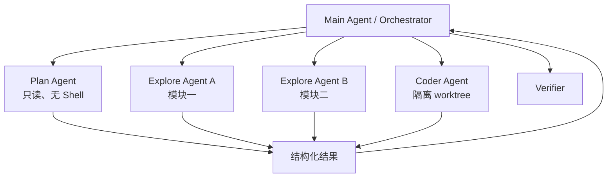

# Subagent、Multi-agent 与任务调度

## 什么时候值得用 Subagent

适合：

- 可独立并行探索多个模块；
- 需要隔离大量中间上下文；
- 不同角色有不同工具权限；
- 一个任务可以定义清晰输入输出契约；
- 失败可局部重试，不污染主轨迹。

不适合：

- 子任务高度共享状态、频繁同步；
- 任务很小，通信成本大于收益；
- 多个 Agent 会编辑相同文件；
- 没有独立 verifier，只是“多叫几个人想想”；
- 只是为了追逐架构潮流。

## Orchestrator–Worker 模式



子任务契约：

```yaml
objective: 找出 token refresh 竞态的最小根因
scope:
  read:
    - src/auth/**
    - tests/auth/**
  write: []
deliverable:
  - 根因
  - 证据路径和行号
  - 最小复现建议
budget:
  max_steps: 20
  timeout_minutes: 8
```

主 Agent 不应把完整子轨迹全部塞回上下文，只接收结果摘要、证据引用、状态和 usage；需要时可按句柄展开。

### 多 Agent 如何避免写冲突？

> 首选把写集按目录/任务分区；需要同时写时使用独立 worktree/branch，让主 Agent 审查并合并 patch。调度器基于声明和实际 file-set 做冲突检测。共享单工作区且并发编辑是最后选择，必须有版本检查和三方合并。Git index 等全局状态不能无保护共享。

### 如何防止 Subagent 失控或递归爆炸？

- 限制最大深度、fan-out、总并发和总预算；
- 只有特定 Agent 有 spawn 权限；
- 子 Agent 继承不超过父 Agent 的权限；
- 每个任务有 deadline、取消传播和心跳；
- 主任务结束前回收后台任务；
- 汇总 usage 与成本到父任务；
- 结构化返回，禁止无边界聊天；
- 全局 scheduler 做公平性和背压。

## 模型路由

路由维度：

- 任务难度与风险；
- 上下文长度；
- 工具调用可靠性；
- 延迟/成本；
- 多模态需求；
- 数据合规；
- provider 健康状态。

不要只用一个分类器“猜难度”。可以先用低成本模型执行，出现特定信号再升级：

- 多次无进展；
- verifier 失败；
- 跨模块复杂任务；
- 高风险决策；
- 小模型工具 schema 错误率高。

### 同一 session 中途切模型有什么坑？

- 不同 provider 消息角色和 tool-call 格式不同；
- tool call ID、thinking block、签名可能不兼容；
- tokenizer 与 context limit 不同；
- 对 system prompt 和并行工具支持不同；
- 历史消息可能需规范化/修复；
- 行为变化会破坏恢复可重复性。

应保存规范化内部 IR，再由 provider adapter 编码；trace 中记录实际模型与 adapter 版本。

---

# Model Gateway 与 Prompt / Tool 兼容层

## 内部统一表示

建议统一：

```text
Message:
  role
  content_blocks[text | image | tool_call | tool_result | reasoning_ref]
  provenance
  timestamp

ToolCall:
  id
  name
  arguments

ModelResponse:
  blocks
  finish_reason
  usage
  latency
  provider_request_id
```

adapter 负责：

- 请求编码和流式事件归一化；
- tool schema 差异；
- usage 与 finish reason 统一；
- provider 错误分类；
- 最大输入/输出预算；
- 重试与幂等边界；
- history repair；
- 能力声明。

## 流式解析

模型可能分片输出：

- 文本 token；
- reasoning；
- tool name；
- tool arguments 的增量 JSON；
- usage；
- finish reason。

Runtime 应在流结束后对 arguments 做最终 schema 验证。不要边收到半个 JSON 边执行。若连接中断，不能假设工具调用完整；记录 interrupted response 并依据 provider 的幂等能力决定是否重试。

## 缓存

可缓存：

- 稳定 system/tool 前缀的 provider prompt cache；
- repo index 与文件摘要；
- 不变的工具资源；
- 相同内容 hash 的 embedding；
- eval replay 的确定性工具结果。

缓存键必须包含：

```text
model + provider + prompt/tool version + content hash
+ permission/scope + repo revision + relevant config
```

缓存最危险的不是 miss，而是错误 hit：把旧分支代码、旧权限或旧工具描述带入当前任务。

### Temperature 设为 0，Agent 是否可复现？

> 不能保证。provider 后端、模型版本、采样实现、并行工具时序、搜索结果、文件状态都会变化。评测要固定可控变量、记录版本并多次运行；调试可以用 trace replay 隔离模型和环境。目标通常是统计稳定性，而非逐 token 一致。

## Subagent 的收益来自隔离，不来自数量

我判断是否拆 Subagent 时，会先估算三项成本：

```text
收益 = 被隔离的无关上下文 + 可并行的等待时间 + 专用权限带来的安全性
成本 = 任务描述损耗 + 结果汇总损耗 + 额外模型调用 + 并发冲突风险
```

例如调查一次跨 `auth`、`billing`、`gateway` 三个模块的超时问题，三个只读 explore Agent 并行通常合理：它们各自读取大量日志和调用链，最后只返回证据。若任务是修改一个 80 行函数，拆成“分析 Agent、编码 Agent、审查 Agent”往往只是把一次本可连贯完成的推理切碎。

### 一个可执行的子任务契约

自然语言 prompt 不应是唯一契约。调度器还应持有结构化元数据：

```yaml
task_id: investigate-auth-refresh
goal_revision: 7
objective: 解释刷新请求为什么在高并发下重复发送
inputs:
  workspace_revision: 91e83d
  evidence:
    - artifact://trace/refresh-timeout
scope:
  read: [src/auth/**, tests/auth/**]
  write: []
capabilities: [read_file, search_text, run_readonly_test]
deliverable_schema:
  root_cause: string
  evidence_refs: list
  confidence: low | medium | high
  unresolved: list
budget:
  max_turns: 16
  max_tokens: 60000
  deadline_seconds: 480
```

返回结果必须绑定 `workspace_revision` 和 `goal_revision`。如果主 Agent 在子任务运行期间已经修改相关文件，结果不能直接当作当前事实，只能作为历史线索重新验证。

## 并发调度要看实际 effect，而不是 Agent 名字

两个 `explore` Agent 通常只读，但它们仍可能同时启动构建、占用同一端口或污染共享缓存；两个 `coder` Agent 也可能因为独立 worktree 而完全不冲突。因此调度器应组合静态声明与运行时观测：

```text
declared_effects  = task contract + tool capabilities
observed_effects  = 实际打开的路径、进程、端口、Git 状态
conflict          = overlap(declared, observed, active_tasks)
```

发现未声明写入时，最安全的处理不是事后合并，而是立刻暂停该子任务并记录 policy violation。并发上限还要同时受 provider 配额、CPU、内存和用户级公平调度约束，不能只设一个 `max_agents=8`。

## Gateway 的核心不是换 URL，而是保存语义

模型 provider 的协议差异常被低估。一个内部 `tool_result` 在不同接口里可能要求：

- 紧邻对应 tool call；
- 使用特定 role；
- 保留或删除中断的 reasoning block；
- tool call ID 满足特定格式；
- 并行调用按原顺序回填；
- 图片、缓存标记和系统指令放在不同位置。

因此 adapter 不只是字段重命名。它应执行一套可版本化转换：

```text
Internal IR
→ capability negotiation
→ history validation / repair
→ provider-specific encoding
→ streamed block assembly
→ finish reason normalization
→ usage and error normalization
```

我会把“修复历史”限制为保持语义的操作，例如为已明确中断的调用补一个 `interrupted` result。若无法确认 call/result 对应关系，Gateway 应拒绝请求，而不是猜测一个看起来能通过 provider 校验的历史。

## 切换模型时应该重建哪些东西

同一 session 从模型 A 切到模型 B，至少重新计算：

| 项目 | 原因 |
|---|---|
| token 预算 | tokenizer 与窗口不同 |
| tool schema 集合 | provider 能力与 schema 限制不同 |
| system/tool 稳定前缀 | prompt cache 边界不同 |
| 并行调用策略 | 有的模型更容易生成依赖冲突 |
| 历史消息编码 | role、block 和 call/result 约束不同 |
| completion policy 阈值 | 模型自报完成的可靠性可能不同 |

但是任务目标、权限、workspace revision 和历史副作用不能随模型变化。模型是可替换决策器，Runtime 状态不是它的私有记忆。

## Kimi Code 公开实现：Subagent 隔离与 Gateway 兼容

Kimi Code 内置的 `coder`、`explore`、`plan` 并不只是三套角色提示词：`coder` 可以读写并执行命令，`explore` 以只读探索为主，`plan` 负责规划且不使用 Shell。Subagent 接收明确任务后使用独立上下文，主 Agent 默认只接收最终结果；权限从父级继承，每个 Agent 还有独立事件流用于恢复和 replay。参见 [Agents and Sub-Agents](https://moonshotai.github.io/kimi-code/en/customization/agents.html) 与 [Sessions and context](https://moonshotai.github.io/kimi-code/en/guides/sessions.html)。

这里最值得借鉴的不是 Agent 数量，而是“能力配置 + 上下文隔离 + 事件隔离”同时存在。只写“你是一名只读研究员”仍然可能调用写工具；从工具层移除写能力，才形成可验证的约束。只给 Subagent 一个新 prompt，也没有解决历史污染；为它建立独立 context，再让输出通过结构化交付物回主 Agent，隔离才真正成立。

如果把这套公开设计用于一次真实任务，我会这样拆：

```text
explore A：定位定义、调用图和仓库规则，不写文件
explore B：复现失败并整理错误签名，不改测试
coder：在指定目录和 base revision 上提交最小 patch
plan：当任务涉及迁移或多个依赖阶段时，维护约束与验收顺序
主 Agent：合并证据、处理冲突、执行最终验证
```

真正需要评测的是：Subagent 是否减少主上下文污染、是否缩短首次找到正确文件的时间、结果过期时能否被拒绝、总成本是否仍然划算。并行数本身不构成产品价值。

另一侧是 Gateway。Kimi Code 的公开 Changelog 长期包含 provider 差异相关修复，例如严格的 tool call ID、不同上下文窗口、工具调用历史修复和 schema 兼容。这说明“改一下 API 地址就能接入 Kimi 模型”只覆盖了最薄的一层。模型请求能成功返回，不等于：

- 中断历史在目标 provider 下仍然合法；
- 并行 tool call 与 result 能正确配对；
- context limit 与缓存边界被正确计算；
- Kimi 适合的工具描述、结果粒度和 compaction 策略已经生效；
- 流式中断、重试和 usage 都具有一致语义。

因此我会把 Gateway conformance 做成可执行用例：同一份内部 IR 分别经过各 adapter，验证 tool call round-trip、并行结果顺序、中断修复、图片/缓存块、错误归一化和 token 计数。Kimi 自有 Harness 的优势不该只是“默认填好了 Kimi 的 endpoint”，而应该体现在这些语义已经围绕模型和 Runtime 联合调过。

---
