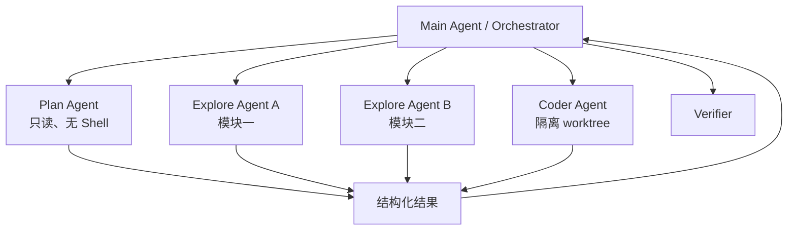

# Subagent、Multi-agent 与任务调度

## 什么时候值得用 Subagent

适合：

- 可独立并行探索多个模块；
- 需要隔离大量中间上下文；
- 不同角色有不同工具权限；
- 一个任务可以定义清晰输入输出契约；
- 失败可局部重试，不污染主轨迹。

不适合：

- 子任务高度共享状态、频繁同步；
- 任务很小，通信成本大于收益；
- 多个 Agent 会编辑相同文件；
- 没有独立 verifier，只是“多叫几个人想想”；
- 只是为了追逐架构潮流。

## Orchestrator–Worker 模式



子任务契约：

```yaml
objective: 找出 token refresh 竞态的最小根因
scope:
  read:
    - src/auth/**
    - tests/auth/**
  write: []
deliverable:
  - 根因
  - 证据路径和行号
  - 最小复现建议
budget:
  max_steps: 20
  timeout_minutes: 8
```

主 Agent 不应把完整子轨迹全部塞回上下文，只接收结果摘要、证据引用、状态和 usage；需要时可按句柄展开。

### 多 Agent 如何避免写冲突？

> 首选把写集按目录/任务分区；需要同时写时使用独立 worktree/branch，让主 Agent 审查并合并 patch。调度器基于声明和实际 file-set 做冲突检测。共享单工作区且并发编辑是最后选择，必须有版本检查和三方合并。Git index 等全局状态不能无保护共享。

### 如何防止 Subagent 失控或递归爆炸？

- 限制最大深度、fan-out、总并发和总预算；
- 只有特定 Agent 有 spawn 权限；
- 子 Agent 继承不超过父 Agent 的权限；
- 每个任务有 deadline、取消传播和心跳；
- 主任务结束前回收后台任务；
- 汇总 usage 与成本到父任务；
- 结构化返回，禁止无边界聊天；
- 全局 scheduler 做公平性和背压。

## 模型路由

路由维度：

- 任务难度与风险；
- 上下文长度；
- 工具调用可靠性；
- 延迟/成本；
- 多模态需求；
- 数据合规；
- provider 健康状态。

不要只用一个分类器“猜难度”。可以先用低成本模型执行，出现特定信号再升级：

- 多次无进展；
- verifier 失败；
- 跨模块复杂任务；
- 高风险决策；
- 小模型工具 schema 错误率高。

### 同一 session 中途切模型有什么坑？

- 不同 provider 消息角色和 tool-call 格式不同；
- tool call ID、thinking block、签名可能不兼容；
- tokenizer 与 context limit 不同；
- 对 system prompt 和并行工具支持不同；
- 历史消息可能需规范化/修复；
- 行为变化会破坏恢复可重复性。

应保存规范化内部 IR，再由 provider adapter 编码；trace 中记录实际模型与 adapter 版本。

---

# Model Gateway 与 Prompt / Tool 兼容层

## 内部统一表示

建议统一：

```text
Message:
  role
  content_blocks[text | image | tool_call | tool_result | reasoning_ref]
  provenance
  timestamp

ToolCall:
  id
  name
  arguments

ModelResponse:
  blocks
  finish_reason
  usage
  latency
  provider_request_id
```

adapter 负责：

- 请求编码和流式事件归一化；
- tool schema 差异；
- usage 与 finish reason 统一；
- provider 错误分类；
- 最大输入/输出预算；
- 重试与幂等边界；
- history repair；
- 能力声明。

## 流式解析

模型可能分片输出：

- 文本 token；
- reasoning；
- tool name；
- tool arguments 的增量 JSON；
- usage；
- finish reason。

Runtime 应在流结束后对 arguments 做最终 schema 验证。不要边收到半个 JSON 边执行。若连接中断，不能假设工具调用完整；记录 interrupted response 并依据 provider 的幂等能力决定是否重试。

## 缓存

可缓存：

- 稳定 system/tool 前缀的 provider prompt cache；
- repo index 与文件摘要；
- 不变的工具资源；
- 相同内容 hash 的 embedding；
- eval replay 的确定性工具结果。

缓存键必须包含：

```text
model + provider + prompt/tool version + content hash
+ permission/scope + repo revision + relevant config
```

缓存最危险的不是 miss，而是错误 hit：把旧分支代码、旧权限或旧工具描述带入当前任务。

### Temperature 设为 0，Agent 是否可复现？

> 不能保证。provider 后端、模型版本、采样实现、并行工具时序、搜索结果、文件状态都会变化。评测要固定可控变量、记录版本并多次运行；调试可以用 trace replay 隔离模型和环境。目标通常是统计稳定性，而非逐 token 一致。

---
