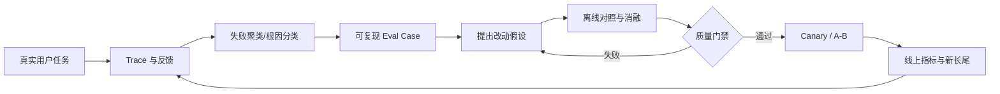

# Evaluation：怎样证明 Agent 真的变好了

## Eval 的基本单位

一个 Agent eval case 至少包含：

```yaml
task:
  prompt: "修复并发刷新导致的重复请求"
environment:
  repo: example/repo
  commit: abc123
  image: sha256:...
  network: disabled
  tools_version: v7
acceptance:
  tests:
    - hidden/test_refresh_race.py
  invariants:
    - public_api_unchanged
  forbidden:
    - modify_tests
budgets:
  wall_time: 20m
  tokens: 200k
grader:
  deterministic: ...
  semantic_rubric: ...
```

必须固定仓库 commit、依赖、镜像、工具与模型配置；否则比较的是环境噪声。

## 指标分层

#### 任务结果指标

- resolve rate / pass rate；
- hidden test pass；
- 人工验收；
- 是否满足范围和禁止项；
- 回归率；
- 用户最终是否接受/撤销。

#### 过程指标

- 首个正确文件召回率；
- 工具选择/参数正确率；
- 无效调用比例；
- 重复错误率；
- 计划完成率；
- context overflow / compaction 次数；
- 需要用户干预次数；
- 恢复成功率。

#### 效率指标

- wall time；
- tokens / cost；
- model turns；
- tool calls；
- 沙箱 CPU/内存；
- **cost per successful task**。

#### 安全指标

- 越权调用；
- prompt injection 攻击成功率；
- secret exposure；
- 破坏性修改；
- approval bypass；
- 测试作弊。

#### 产品指标

- task completion；
- 用户接受 patch 的比例；
- 修改后保留率/撤销率；
- time-to-merge；
- 用户中途接管率；
- 周期性留存。

### 为什么只看最终 pass rate 不够？

> 最终结果样本效率低，而且会掩盖退化：一个版本成功率不变，但成本翻倍、危险动作增加或靠更多重试堆出来。过程指标帮助定位归因，安全与效率指标约束不可接受的“优化”。不过过程指标是诊断信号，最终仍要与真实任务成功相关，不能为降低工具数牺牲结果。

## 评测数据集构建

来源：

- 经过同意和脱敏的真实用户失败任务；
- 公共 issue/PR 构建的任务；
- 内部工程师设计的能力切片；
- 对历史任务做 mutation；
- 安全红队任务；
- 线上 canary。

分层：

```text
Smoke（分钟级）
→ Capability Slice（搜索/编辑/恢复等单能力）
→ Regression（历史失败）
→ Full Repository Tasks（长链路）
→ Online Shadow / Canary
```

切分时按 **repo、时间、任务族** 去重，避免同仓库相似 patch 泄漏到 train/dev/test。公开 benchmark 还要考虑模型训练污染。

### 如何从线上 trace 变成高质量 eval？

1. 脱敏并确认授权；
2. 固化任务开始时的 repo/environment；
3. 把用户真实意图转成明确 acceptance；
4. 保留失败 trace 作为诊断，不把它当标准答案；
5. 建立确定性测试和必要的人工 rubric；
6. 审核任务是否可解、是否存在多种正确解；
7. 标注失败分类和难度；
8. 去重并做时间切分；
9. 定期重审 grader，防止模型进步后测试成为瓶颈。

## Grader 设计

优先级：

1. **确定性环境检查：** build、test、lint、类型检查；
2. **结构化规则：** diff 范围、禁止文件、API 兼容；
3. **行为测试：** hidden cases、性能、安全；
4. **LLM-as-judge：** 语义质量、解释、可维护性；
5. **人工评审：** 高价值、难自动化样本。

LLM judge 不能直接当真值：

- 做 pairwise 往往比绝对打分稳定；
- 隐藏候选身份，随机左右顺序；
- 明确 rubric 并给证据；
- 用专家标注校准；
- 测 position bias、verbosity bias、自偏好；
- 多 judge 或多次采样估计不确定性；
- judge 只看到需要的信息，避免泄漏参考 patch。

### 测试全过了就算成功吗？

> 不一定。测试可能不完整、有缺陷，Agent 也可能修改测试或过拟合。还要看任务约束、diff 范围、隐藏测试、API 兼容和代码质量。反过来测试失败也不总等于方案错误，可能是 benchmark 环境或 grader 缺陷。因此 eval 本身也需要审计。

2026 年 OpenAI 对 SWE-bench Verified 的复核指出污染和测试缺陷会削弱 benchmark 的区分度，并建议使用更新、更可靠的评测。这一案例说明“排行榜数字”不能替代对任务、测试和失败样本的检查。参见 [Why SWE-bench Verified no longer measures frontier coding capabilities](https://openai.com/index/why-we-no-longer-evaluate-swe-bench-verified/)。

## 实验设计

比较 baseline 与 candidate：

- 完全相同的任务集合与环境；
- 最好 paired run，降低任务难度方差；
- 非确定系统每个 case 多个 seed/run；
- 报告均值之外给置信区间；
- 同时看总体与关键 slice；
- 预先定义 primary metric 和 guardrail metric；
- 避免反复看测试集调参；
- 记录模型、prompt、tools、runtime、image 的完整版本。

对二元成功率的 paired 比较可用 McNemar test 或 bootstrap；对成本/时长等长尾指标可用 paired bootstrap，并报告中位数和高分位。

### 成功率从 40% 到 42%，能上线吗？

> 不能只看 2 个百分点。要看样本量和配对差异的置信区间、提升集中在哪些任务、是否牺牲成本/延迟/安全、是否存在严重回归。若离线证据正向但不充分，可在低风险流量 shadow 或小比例 canary，设停止条件，再逐步扩大。

## 消融与错误归因

Agent 是模型、prompt、context、tools、runtime、environment 的乘积。归因方法：

| 干预 | 能回答的问题 |
|---|---|
| 给 oracle 文件集合 | 检索是否是瓶颈 |
| 给 oracle 计划 | 规划是否是瓶颈 |
| 给 oracle 工具结果 | 工具执行/观察是否有问题 |
| 固定模型，只换 Runtime | 系统改动贡献 |
| 固定 Runtime，只换模型 | 模型能力贡献 |
| replay 同一轨迹到某一步 | 从哪一步开始偏离 |
| 禁用某工具/记忆/Subagent | 组件是否真有贡献 |
| 人类接管一步后继续 | 哪类干预最关键 |

不要强迫每个失败只有一个标签。推荐：

```text
root_cause: context.retrieval.missed_definition
contributors:
  - tool.search.result_truncated
  - model.did_not_follow_error_hint
detected_at: test.hidden_failure
recoverable: true
```

## Eval Flywheel



### 评测集会不会被“刷题”刷坏？

会。防止方法：

- 保留不可见 holdout；
- 按时间滚动加入新任务；
- 用任务 mutation 扩展等价变化；
- 不把参考 patch 暴露给 Agent；
- 关注跨 repo 泛化；
- 对异常提升审计 trace；
- 定期淘汰饱和、污染或 grader 有缺陷的任务；
- 线上真实指标作为最终约束。

---

# Observability 与 Trace Analysis

## 三类可观测数据

- **Logs：** 离散事件和错误，适合检索；
- **Metrics：** 聚合趋势、SLO 和告警；
- **Traces：** 一次任务的因果链，适合定位 Agent 行为。

Agent trace span 层级：

```text
session
└── turn
    ├── context.build
    │   ├── search
    │   └── compact
    ├── model.generate
    ├── tool.execute
    │   └── process / remote / mcp
    ├── subagent.run
    └── verifier
```

每个 span 建议记录：

- session/turn/agent/call ID；
- model/provider/tool 版本；
- start/end/status；
- token、cost、bytes；
- timeout/retry/cancel；
- 输入输出 hash 与受控预览；
- workspace revision / image；
- permission decision；
- error taxonomy。

## 隐私与可调试性的平衡

不能为调试默认永久保存完整代码、prompt、密钥和 Shell 输出。

- 内容与元数据分离；
- 默认只存 hash、长度、类型和脱敏摘要；
- 详细 trace 需要用户同意或短期 debug 模式；
- secret scanner 在落盘前运行；
- tenant 隔离、访问审计、TTL；
- eval 数据二次脱敏；
- UI 支持导出前预览；
- 能按用户请求删除。

## 失败分类

可建立层次化 taxonomy：

```text
intent
  ├── misunderstood_requirement
  └── missing_clarification
context
  ├── retrieval_miss
  ├── stale_context
  ├── over_compression
  └── instruction_conflict
planning
  ├── wrong_decomposition
  └── goal_drift
tool
  ├── wrong_selection
  ├── invalid_arguments
  ├── execution_failure
  └── observation_truncation
editing
  ├── stale_write
  ├── patch_failure
  └── unrelated_change
verification
  ├── insufficient_tests
  ├── test_cheating
  └── false_completion
runtime
  ├── timeout
  ├── cancellation
  ├── recovery
  └── provider_protocol
safety
  ├── permission
  ├── injection
  └── exfiltration
```

### 如何分析“Agent 跑了 30 分钟最后失败”的 trace？

参考步骤：

1. 先判断 acceptance 是否清晰且任务可解；
2. 找第一次不可逆或关键偏离，而不是只看最后错误；
3. 画 goal/plan 随时间变化；
4. 检查关键文件何时首次出现、是否后来被压缩丢失；
5. 聚合同一工具、错误签名、workspace diff；
6. 查看验证反馈有没有正确进入下一轮；
7. 做 counterfactual replay：从偏离点给 oracle 提示继续；
8. 将根因转成可重复 eval，不只修这一个 prompt。

## Trace Replay

三种 replay：

- **Full live replay：** 模型与工具重跑，最真实但不稳定；
- **Tool replay：** 固定历史工具结果，只重跑模型，隔离模型变化；
- **Model replay：** 固定模型输出，重跑 Runtime/工具，验证协议与状态；
- **Deterministic fold：** 不执行任何外部动作，只验证事件重建。

工具 replay 必须注意：历史 observation 可能含时间、随机数或敏感信息；它适合调试，不等价于真实成功率。

## 高频可观测性问题

### 日志里应不应该记录模型完整 reasoning？

> 默认不依赖也不长期保存隐藏 reasoning。调试应记录可用的模型输出、工具调用、结果、决策元数据和外显摘要。完整内容受 provider 能力、隐私和安全策略约束。真正可操作的可观测性来自行为轨迹，不是窥探思维链。

### 如何监控 goal drift？

- 计划节点长期不更新；
- tool call 与当前 acceptance 语义距离增大；
- 修改文件超出预测范围；
- 原验收条件在摘要中消失；
- 重复探索已确认事实；
- verifier 反馈多次未被响应；
- 人工标注一批 drift trace 训练分类器。

检测器只用于提醒或触发重新规划；高误报时不能频繁打断正常探索。

---
