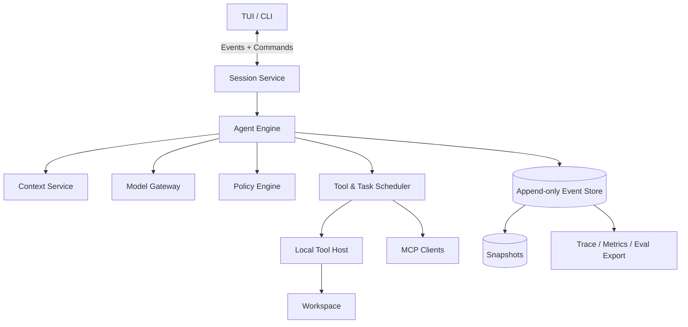
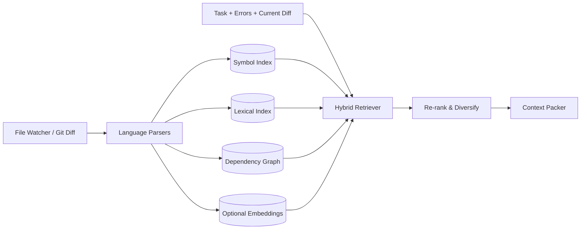
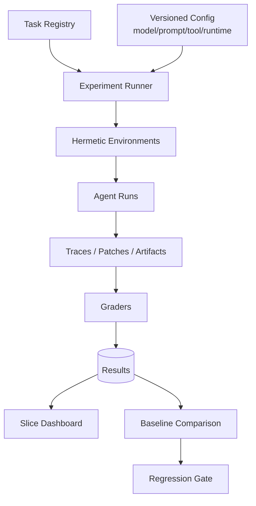

# 系统设计参考

我通常按这个顺序收敛系统设计：

```text
澄清用户与范围
→ 定义成功指标和安全约束
→ 估算规模
→ API / 数据模型
→ 核心数据流
→ 一致性与失败恢复
→ 安全与隔离
→ 可观测与评测
→ 取舍和演进
```

先别急着画微服务，先确认：

- 本地 CLI 还是云端服务？
- 单用户还是多租户？
- 是否允许修改/执行代码？
- 任务持续多久、并发多少？
- 是否支持用户中途交互？
- 成功由测试、用户还是远端 CI 判断？
- 代码是否允许出本地？

## 设计一个终端 Coding Agent

#### 需求

- 在当前仓库接受自然语言任务；
- 搜索、读写文件、运行命令和测试；
- 流式展示进度；
- 可取消、继续和恢复；
- 高风险动作批准；
- 支持多个模型和 MCP；
- 生成可审阅 diff。

#### 高层组件



本地单用户 MVP 可以是一个进程加 SQLite/JSONL，不需要微服务；云端多租户再拆 Session、Sandbox、Model Gateway 和 Artifact 服务。

#### API 示例

```http
POST /sessions
POST /sessions/{id}/messages
POST /sessions/{id}/cancel
POST /sessions/{id}/approvals/{approval_id}
GET  /sessions/{id}
GET  /sessions/{id}/events?after_seq=...
WS   /sessions/{id}/stream
```

#### 数据模型

```text
Session(id, user_id, workspace_id, status, model_config, permission_mode,
        created_at, updated_at, last_seq)
Turn(id, session_id, status, started_at, ended_at, usage, stop_reason)
Event(session_id, seq, type, payload_ref, schema_version, timestamp)
ToolCall(id, turn_id, name, args_hash, effect, status, result_ref)
Artifact(id, session_id, kind, uri, sha256, bytes, ttl)
Snapshot(session_id, seq, state_blob_ref)
Approval(id, tool_call_id, scope, decision, expires_at)
```

#### 一致性

- `Session.last_seq` 与 Event append 在一个本地事务中更新；
- UI 以 seq catch-up；
- tool result 先持久化再进入下一次模型请求；
- 外部副作用使用幂等键/reconcile；
- snapshot 只是加速，event log 才是事实源；
- artifact 内容寻址，事件只保存引用。

#### 扩展性

假设 10 万日活、每人每天 5 个任务、每任务 30 次模型轮次：

- 每日 1500 万次模型调用，是主要成本与限流点；
- 工具输出体积远大于结构化事件，需要对象存储；
- 长连接按 session 分片；
- 沙箱是资源调度问题，按 CPU/内存和任务优先级排队；
- provider 配额按 tenant 与模型做 token bucket；
- session actor/lease 确保同一主 Agent 单写，多读投影可横向扩展。

## 容易被忽略的边界

**问：同一个 session 两台 worker 同时执行怎么办？**

> 使用 lease/fencing token。worker 获取有过期时间的 session lease，所有事件 append 带 fencing token；旧 worker 即使网络恢复也无法写入。用户消息可进入独立持久队列，由当前 owner 消费。

**问：WebSocket 丢事件怎么办？**

> WebSocket 只是通知通道，不是事实源。帧携带 seq，客户端检测 gap 后从 REST 拉 `after_seq`；journal 不足则拉 snapshot 加增量。reducer 幂等。

**问：如何让 Agent 在 CLI 退出后继续？**

> 把执行 owner 从 CLI 进程移到本地 daemon 或远程 session service。CLI 只订阅事件；断开不取消任务，除非用户明确要求。凭据和批准策略需适配 unattended 模式。

## 设计百万文件 monorepo 的上下文系统

#### 目标

- 首次有用结果低延迟；
- 代码变化后索引快速更新；
- 支持多语言；
- 检索结果可解释；
- 不把整个仓库上传到不允许的服务。

#### 架构



#### 索引策略

- 以内容 hash 增量更新，rename 尽量复用；
- ignore vendor/build/binary，保留可配置例外；
- lexical index 存路径、行范围和版本；
- symbol index 存定义/引用/签名；
- graph 分模块分片，不强求动态调用完全准确；
- embedding 以函数/类/文档块为单位，模型版本进入索引版本；
- 冷启动先提供路径 + rg，后台补齐深索引；
- 对当前 dirty files 做 overlay，不等全量 index commit。

#### 排序与预算

- query 从任务文本、报错、stack、已知 symbol 多路生成；
- 先高召回，再用路径、符号关系和任务阶段重排；
- MMR/去重控制相似测试和生成代码；
- 按“定义、调用方、测试、配置、规则”做配额；
- 每段保留 source、revision、line range 和 retrieval reason。

#### 评测

- file recall@k、symbol recall@k；
- oracle context 下的任务成功上界；
- 检索延迟和索引 freshness；
- token-normalized useful context；
- 检索引入错误实现的比例；
- 按语言、仓库大小、任务类型切片。

**问：向量库挂了，系统能不能工作？**

> 应该可以降级到路径、词法、符号和 Git 信号。代码标识符检索本来就很依赖精确匹配。降级状态要进入 trace，避免把召回下降误归因于模型。

**问：如何索引用户未提交修改？**

> 使用 overlay index：基线索引对应 commit，dirty file 在内存或 session 层覆盖；检索合并时以 overlay 为准并屏蔽基线同文件旧块。每次写入只增量更新相关文件。

## 设计多租户远程执行沙箱

#### 核心链路

```text
任务请求
→ 鉴权与策略
→ 选择镜像/缓存
→ 调度 ephemeral sandbox
→ 拉取代码与依赖
→ 受控执行
→ 流式日志/产物
→ 快照或销毁
```

#### 控制面与数据面

- **控制面：** task、quota、scheduler、image、lease、policy；
- **数据面：** sandbox runtime、workspace volume、log/metric sidecar、egress proxy；
- **凭据面：** secret broker 发短期 token，不经过模型上下文；
- **产物面：** content-addressed artifact store。

#### 关键设计

- 每任务独立身份与 namespace；
- rootless / microVM，根据风险分级；
- egress 默认关闭，开放时代理记录域名与字节数；
- 依赖缓存只读共享，写层任务隔离；
- 用户代码不可控制 sidecar；
- 资源 cgroup 配额与 watchdog；
- 任务取消传播到整个进程树；
- 镜像和依赖有 provenance/SBOM；
- 销毁前收集授权产物，随后清理磁盘和 secret。

**问：如何兼顾冷启动？**

> 做热门语言镜像池、分层镜像、按 lockfile key 的只读依赖缓存和 snapshot restore。不能为了速度复用带有用户可写状态的沙箱。衡量 queue time、provision time、cache hit 和隔离事件。

**问：依赖安装需要网络怎么办？**

> 优先企业/平台代理与包仓库 allowlist；绑定任务批准，限制协议、域名和响应大小；凭据由代理注入，不暴露给进程环境；记录 lockfile 与下载摘要，防依赖投毒。

## 设计 Coding Agent 评测平台

#### 组件



#### 平台要求

- task、environment、grader 全版本化；
- 支持矩阵实验和 paired baseline；
- 队列去重、失败重试但不覆盖原 attempt；
- 基础设施失败与 Agent 失败分开；
- 结果不可只存 aggregate，要保留 case-level；
- 隐藏测试与 Agent 权限隔离；
- 预算与成本统计；
- 敏感 repo 按 tenant 隔离；
- 自动生成回归报告和严重样本链接。

**问：评测跑一半机器坏了，这个 case 算失败吗？**

> 不应算 Agent 失败。结果状态区分 `agent_failed`、`grader_failed`、`infra_failed`、`timed_out`、`invalid_task`。基础设施失败按策略重跑并保留 attempt；报告覆盖率，不能静默丢 case。

## 设计 IDE 集成

IDE 与 CLI 的差异：

- IDE 有打开文件、光标、selection、diagnostics 等高价值上下文；
- 用户会边看边改，冲突更频繁；
- edit 应用需走 `WorkspaceEdit` 或可预览 diff；
- Agent 状态与 UI 生命周期解耦；
- extension host 不能被长任务阻塞；
- LSP、终端、Git 权限和 remote workspace 各有边界；
- 需要处理工作区信任与企业策略。

如果通过 ACP 等 Agent/编辑器协议集成，要把协议看作 adapter：Agent Engine 的 session、events、tools 和 approval 不应绑死某个 IDE。

---

# 故障分析案例

分析失败 trace 时，我通常按这个顺序推进：

```text
现象 → 先保护用户 → 收集证据 → 首次偏离点
→ 根因假设 → 最小实验 → 修复 → 防回归 → 指标
```

## Agent 连续五次搜索同一关键词

可能原因：

- 搜索返回被截断但未标明；
- 结果格式太噪，模型没看到关键路径；
- 压缩后遗忘已搜过；
- 工具调用没有正常 result 配对；
- 模型没有替代策略；
- 搜索缓存错误返回旧结果。

排查：

1. 对齐 tool call/result ID；
2. 看每次参数和 observation 是否真的相同；
3. 检查 truncation、exit code、index freshness；
4. 看计划/摘要是否记录“已搜索”；
5. tool replay 换模型；
6. 给 oracle 结果看能否继续。

修复可能包括结构化结果、错误提示、循环检测、历史动作摘要、替代工具建议。指标看重复调用率与任务成功率，不能只粗暴禁止重复搜索。

## Patch 明明正确，却一直提示 hunk failed

可能原因：

- 文件已被用户或另一个 Agent 修改；
- 换行符/编码不同；
- 模型基于压缩前旧内容；
- patch parser 与模型格式不兼容；
- 路径相对根目录解析错；
- 同一 patch 被重复执行。

正确处理：

- 重新读目标范围与 hash；
- 返回冲突处而不是完整大文件；
- 小范围尝试三方/模糊匹配，但设置置信阈值；
- 不能确认则让模型重生成；
- 已应用则返回 idempotent success；
- 记录 stale write 作为独立失败类。

## 测试通过，但用户说功能没修好

调查：

- acceptance 是否漏掉用户真实场景；
- Agent 是否只跑了窄测试；
- 测试是否被修改、skip 或 mock 过度；
- 环境配置与用户生产不同；
- 是否有 UI/性能/并发等非功能要求；
- 用户需求在压缩中丢失。

长期措施：

- 把该真实场景变成 regression eval；
- 任务开始时提取可验证 acceptance；
- verifier 检查 test discovery 与 diff；
- 增加用户语义验收，不把单元测试当唯一真值。

## Context 压缩后 Agent 走回已否决方案

根因是摘要没有保留负面知识。修复摘要 schema，显式保留：

- 尝试了什么；
- 为什么失败；
- 错误签名；
- 哪个假设已被证伪；
- 什么新证据才允许重试。

为压缩做“禁止方案记忆”故障注入 eval，并检查恢复 Agent 是否重复。

## 取消任务后 CPU 仍占满

依次看：

- 取消是否只停模型流，没有传到工具；
- 子进程是否新建了自己的进程组；
- background task 是否脱离结构化并发；
- Subagent 是否有父子取消树；
- 远程 executor 是否收到 lease revoke；
- 输出 reader 是否仍挂住；
- cleanup 是否因 `CancelledError` 被二次取消。

修复后测试取消传播延迟、进程树残留、端口/临时文件泄漏，并加入随机时点取消测试。

## 某次发布成功率提升，成本却翻倍

分解：

- 模型轮次是否增加；
- tool calls 是否重复；
- context 是否变大；
- compaction 是否更频繁；
- 是否更多任务“靠重试成功”；
- Subagent fan-out；
- 任务 mix 是否变化。

使用 paired case 对比 `Δsuccess / Δcost`，按任务 slice 判断。可能选择只对高难度任务启用新策略，或在检测到停滞时再升级。

## 线上成功率下降，但离线 benchmark 不变

可能：

- 线上任务分布漂移；
- benchmark 饱和或被过拟合；
- 线上 workspace/权限/网络不同；
- provider 或依赖版本变化；
- 失败发生在交互、恢复、延迟，离线没覆盖；
- 用户取消率增加但最终测试指标看不到。

行动：

- 比较输入/仓库/工具分布；
- 从下降 slice 抽取 trace；
- 构建 time-based 新 eval；
- 复现真实基础设施；
- 检查产品指标而非只看 patch pass。

## MCP 工具返回的网页内容诱导 Agent 读取密钥

立即：

- policy 层拒绝敏感读取；
- 标记 incident，保留脱敏审计；
- 中止潜在网络外传；
- 通知用户该工具内容不可信。

长期：

- 数据来源标记；
- 网络工具与敏感文件工具组合策略；
- server/tool allowlist 与版本锁定；
- injection 红队 eval；
- secret access 单独批准；
- 不把 MCP 返回内容写入长期 memory。

## 模型返回两个可并行工具，实际产生竞态

原因是 Runtime 盲信模型的并行建议。让工具声明/推导 effect set，调度器进行冲突图着色；未知 effect 默认串行。有共享 Git index、端口、数据库的工具声明全局锁。通过 race replay 和相同 workspace 最终 hash 验证确定性。

## Session 恢复后重复执行了发布动作

这是严重幂等事故：

1. 暂停该类自动恢复；
2. 根据外部系统 transaction/idempotency key reconcile；
3. 事件记录区分 proposed、started、confirmed；
4. 结果未知时绝不自动重发；
5. 发布类动作默认逐次批准；
6. 用每个 crash point 的故障注入覆盖。

## 把这些组件放回一条真实请求链

单独讨论 Context Service、Model Gateway 或 Sandbox 很容易，每个组件都能画得很漂亮。真正的系统问题出现在它们共享一个任务状态时。一次云端 Coding Agent 请求可以按下面的顺序落地：

```text
1. Session Service 接收用户消息，写入 event log
2. Session owner 取得带 fencing token 的 lease
3. Context Builder 基于 goal revision 和 workspace revision 生成上下文
4. Model Gateway 发起请求，流式事件只作为 provisional output
5. Tool call 完整后进入 Policy，生成 effect 与 approval decision
6. Scheduler 选择本地工具、MCP 或远程 sandbox
7. Executor 写 started event，执行并生成 effect fingerprint
8. terminal result 落盘后，才允许下一轮模型请求读取
9. Completion Policy 对照 acceptance、diff 和验证产物
10. Turn 完成，UI 通过 seq 收敛到同一状态
```

这里有几条跨组件约束：

- Context Builder 只能读取已提交到事件流的 tool result，不能读取 UI 暂存状态；
- Scheduler 不能因为模型输出了“parallel”就跳过 effect 冲突检测；
- Sandbox 完成不等于任务完成，产物仍要经过 verifier；
- UI 断线不应改变任务所有权，用户明确 cancel 才改变执行状态；
- Model Gateway 重试不能创建新的逻辑 tool action；
- 所有成本、延迟和失败都要能归到同一个 session/turn/action。

## 容量估算里真正昂贵的不是 HTTP QPS

假设峰值有 20,000 个活跃 session，每个 session 平均：

- 1 个进行中的模型请求；
- 0.3 个活跃 Shell/测试进程；
- 2 个长连接订阅者；
- 50 KB/s 的工具日志峰值；
- 120k 输入 token 和 8k 输出 token 的高分位预算。

需要重点保护的是：

1. **Provider 并发与 token throughput。** 同样 1 QPS，大上下文请求占用的容量可能相差几十倍；
2. **Sandbox slot。** 测试任务会长期占用 CPU、内存和磁盘，不能用普通请求队列调度；
3. **日志与 artifact 写入。** 20,000 × 50 KB/s 已经是 1 GB/s 峰值，必须限流、截断和异步落对象存储；
4. **长连接 fan-out。** WebSocket 是投影视图，不能让慢客户端反压 session 执行；
5. **恢复风暴。** provider 或区域故障后，大量 session 同时 retry/resume，需要 jitter、租户公平性和全局熔断。

因此容量单位不应只有 request。至少还要有 `input_tokens`、`output_tokens`、`sandbox_cpu_seconds`、`artifact_bytes` 和 `active_session_slots`。

## 从单机演进到多租户时，我不会一开始拆微服务

一个本地 CLI 的合理起点是：

```text
单进程 Runtime
+ SQLite/JSONL 事件
+ 本地 artifact 目录
+ 子进程 executor
+ 明确的 provider/tool adapter
```

先把状态边界和接口稳定下来。需要远程长任务时，可以把 executor 与 session owner 移到 daemon；需要多租户时，再根据隔离和负载拆出 Sandbox Scheduler、Artifact Store、Model Gateway。过早拆服务不会自动得到恢复能力，只会把本地事务变成分布式一致性问题。

拆分顺序应由压力决定：

| 压力 | 优先拆出的边界 |
|---|---|
| 不可信代码与资源竞争 | Sandbox / Executor |
| 多 provider 配额与成本 | Model Gateway |
| 大体积日志与 patch | Artifact Store |
| 大量断线恢复和多端 UI | Session Service |
| 离线实验吞吐 | Eval Runner |

架构成熟度不体现在服务数量，而体现在把组件放回单进程后，语义仍然清楚；把组件拆到多机后，不变量仍然成立。

---
